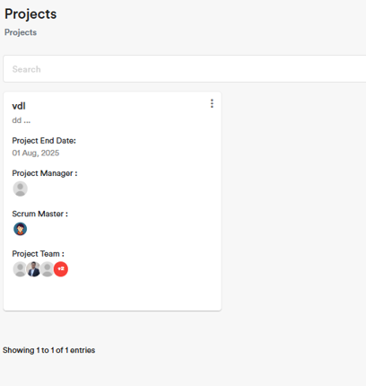
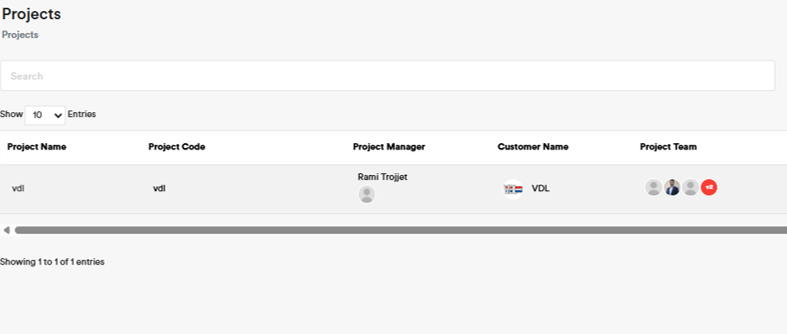

Project Management
===================================

Use **Projects** to register and assign **Projects** to **Employees** .

.. code-block:: console

   Please take into consideration that Each Employee has a predefined Role and Permission with limited/unlimited CRUD actions to perform on Projects data. 

.. note::
    
   The listed **Projects** data is added/edited by **Resource Manager** and **Admin** users.

   **Project Team** memeber udner the Role of a Normal User has permission to Add, Edit, and Export **Timesheet** data .

Fields Definition
-------------------

|**Project Name:**

  The project name.

|**Project Code:**
    The project short code linked to the **Project Name**.

|**Project Manager:**
    The assigned **Employee** to the **Project** .

.. code-block:: console

   Please take into consideration that all Employees can be assigned to one or multiple Projects as a Project Manager.

|**Customer Name:**
     The assigned **Customer** to the **Project**.

.. code-block:: console

   Please take into consideration that Customers can be linked to one or multiple Projects.

|**Project Team:**
     The assigned **Employee** to the **Project** .

|**Scrum Master:**
     The assigned **Employee** to the **Project** .

.. code-block:: console

   Please take into consideration that all Employees can be assigned to one or multiple Projects as a Scrum  Manager.

|**Project Start Date:**
     The start date of the **Project** . 

.. note::
    
   Please note that you **Employees** cannot book book **Timesheet** before the start date of the **Project** .

|**Project End Date:**
     The end date of the **Project** . 

.. note::
    
   Please note that **Employees** cannot book Timesheets after the end date of the **Project**.

|**Project Description:**
     The Project full name or full description.

|**Files:**
     The files attached to the **Project** . 

|**Status:**
----------------

      |Active

      A **Project** under status **Active** is an actual **Project**

      |Inactive

      A **Project** under status **Inactive** is an archived **Project**

Project Fields Defitinion UI:
___________________________________

   Grid View_Projects interface

   List View_Projects interface

