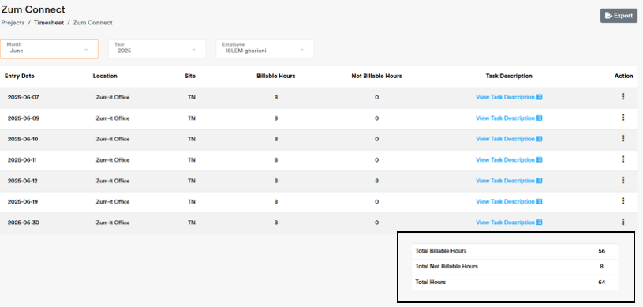

Project Management
===================================

Use **Projects** to register and assign Projects to **Employees** .

.. code-block:: console

   Please take into consideration that Each Employee has predefined **Role** and **Permission** with limited/unlimited CRUD actions to perform on **Projects** data. 

Fields Definition
-------------------

|**Project Name:**

   The field provides a clear project title.

|**Project Code:**
    The field provides a short project code linked to **Project Name**.

|**Project Manager:**
    The field provides assigned user to **Project** based on **Role**

.. code-block:: console

   Please take into consideration that any **Employee** can be assigned as a **Project Manager**

.. code-block:: console

   Please take into consideration that billable hours is your actual allocation time to a **Project** .

|**Not Billable Hours:**
     Use billable hours to specify the spent non-working hours when booking timesheet.

.. code-block:: console

   Please take into consideration that not billable hours is your non allocation time to a **Project** .

|**Task Description:**
     Use task description to specify the task you wokred on during the allocation time.

.. note::
    
   Use **Export** CTA to download your **Timesheet** in an Excel file

.. note::
    
   Use below table to review the spent working hours in total. 

   Timesheet interface
