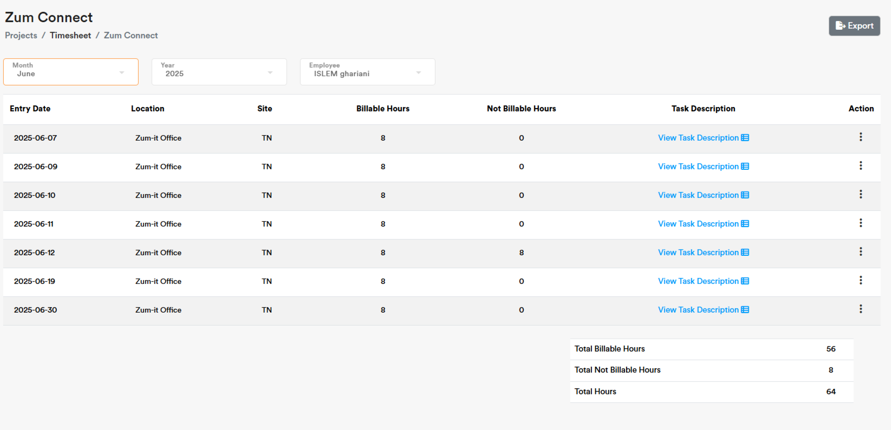

Timesheet Management
===================================

Use **Timesheet** to book hours against your assigned to **Projects** 

.. note::
    
   You can raise **Project Allocation** **Request** from a **Resource Manager** **Role** in case you are not yet assigned to a **Project**. Only then you can book your hours.

Fields Definition
-------------------

|**Entry Date:**
    Use entry date to specify your current working date when booking timesheet.

|**Location:**
    Use location to specify your current working place when booking timesheet. 

|**Site:**
    Use site to specify your current site code when booking timesheet.

|**Billable Hours:**
    Use billable hours to specify the spent working hours when booking timesheet.

.. code-block:: console

   Please take into consideration that billable hours is your actual allocation time to a **Project**.

|**Not Billable Hours:**
     Use billable hours to specify the spent non-working hours when booking timesheet.

.. code-block:: console

   Please take into consideration that not billable hours is your non allocation time to a **Project**.

|**Task Description:**
     Use task description to specify the task you wokred on during the allocation time.

.. note::
    
   Use Export CTA to download your **Timesheet** in an Excel file

.. note::
    
   Use below table to review the spent working hours in total. 

